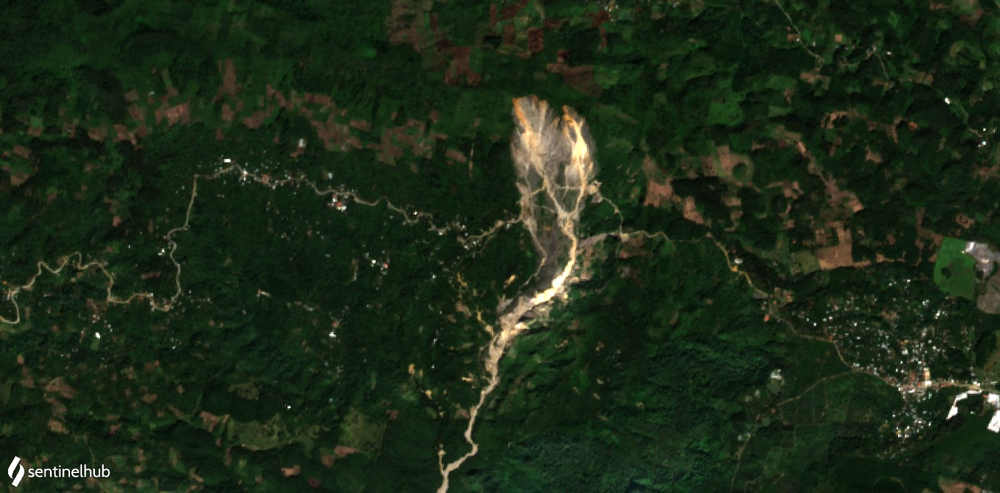
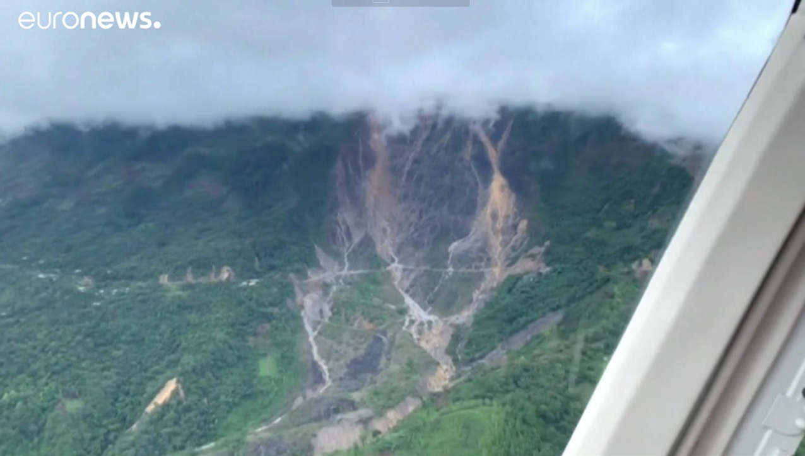
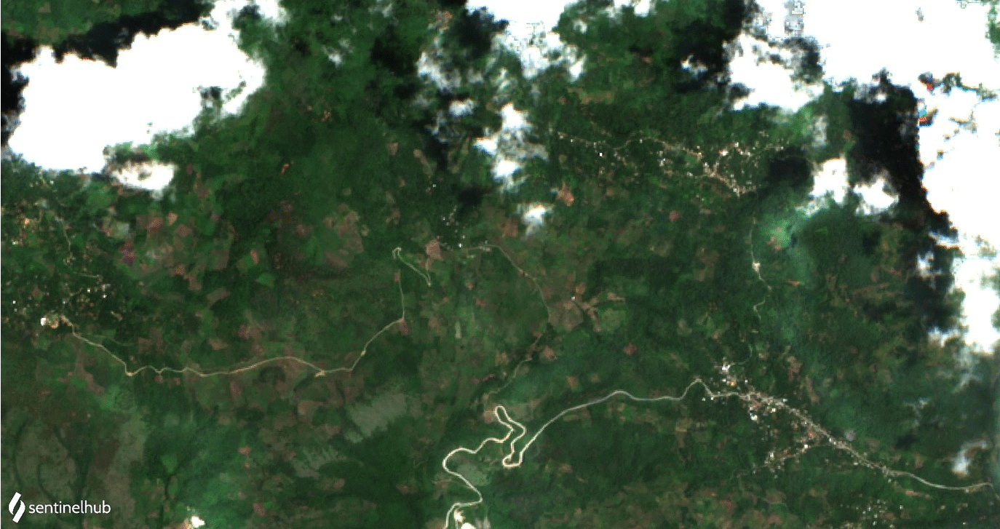
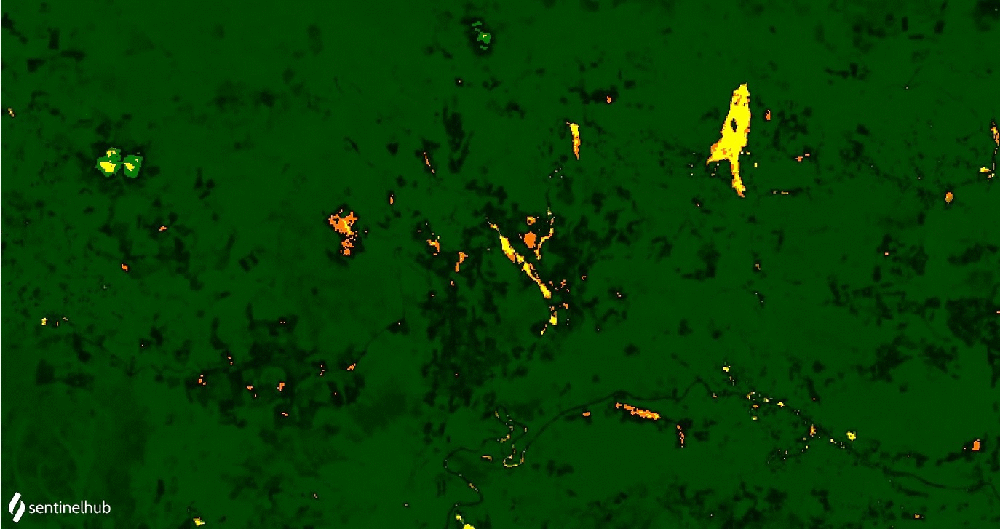

# Landslide detection for rapid Mapping Using Sentinel 2

<a href="#" id='togglescript'>Show</a> script or [download](script_landslides_det.js){:target="_blank"} it.


      


## Description
This repository is a basic scripts - explained in - for analysing landslides using space-based data in, [**Sentinel Playground**](https://www.sentinel-hub.com/explore/sentinelplayground/) or [**EO Browser**](https://www.sentinel-hub.com/explore/eobrowser/). It aims to facilitate working with big data in the cloud as an alternative to using desktop software.

The compilation has been created to support the [UN-SPIDER Knowledge Portal](http://www.un-spider.org/).

## Evaluation and visualization
* [Sentinel Playground](https://apps.sentinel-hub.com/sentinel-playground/?source=S2L2A&lat=15.38928749640127&lng=-90.63991069793701&zoom=15&preset=CUSTOM&layers=B01,B02,B03&maxcc=100&gain=1.0&gamma=1.0&time=2020-05-01%7C2020-11-11&atmFilter=&showDates=false&evalscript=Ly9WRVJTSU9OPTMuTGFuZHNsaWRlX2RldGVjdGlvbi5VTlNQSURFUgoKLy9ieSBOb3JtYSBkYXZpbGEgJiBBbGV4YW5kZXIgQXJpemEKCmZ1bmN0aW9uIHNldHVwKCkgewogIHJldHVybiB7CiAgICBpbnB1dDogWyJCMDIiLCAiQjAzIiwgIkIwNCIsICJCMDgiLCAiQjExIiwiQ0xNIl0sCiAgICBvdXRwdXQ6IHsgYmFuZHM6IDMgfSwKICAgIAogIH07Cn0KZnVuY3Rpb24gc3RyZXRjaCh2YWwsIG1pbiwgbWF4KSB7cmV0dXJuICh2YWwgLSBtaW4pIC8gKG1heCAtIG1pbik7fQpmdW5jdGlvbiBldmFsdWF0ZVBpeGVsKHNhbXBsZSkgewogIHZhciBic2kgPSAoKHNhbXBsZS5CMTEgKyBzYW1wbGUuQjA0KS0oc2FtcGxlLkIwOCArIHNhbXBsZS5CMDIpKS8oKHNhbXBsZS5CMTEgKyBzYW1wbGUuQjA0KSsoc2FtcGxlLkIwOCArIHNhbXBsZS5CMDIpKTsKICB2YXIgTkRWSSA9IGluZGV4KHNhbXBsZS5CMDgsIHNhbXBsZS5CMDQpOwogIHZhciBORFdJPWluZGV4KHNhbXBsZS5CMDMsc2FtcGxlLkIwOCk7CiAgICAgICAgaWYgKHNhbXBsZS5DTE0gPT0gMSkgewogICAgcmV0dXJuIFtzYW1wbGUuQjA0LAogICAgICAgICAgICBzYW1wbGUuQjAzLAogICAgICAgICAgICAzKnNhbXBsZS5CMDJdCn0KICAKaWYgKE5EV0kgPiAwLjE1KSB7CiByZXR1cm4gWzAsIDAuMiwgMS4wKk5EV0ldCn0KaWYoKHNhbXBsZS5CMTE%2BMC44KXx8KE5EVkk8MC4xNSkpewogIHJldHVyblsxLjUsMC43LC0xXQp9ICAKaWYgKE5EVkk%2BMC4yNSl7CiAgcmV0dXJuIFswICwgMC4yKk5EVkksIDBdCn0KZWxzZSB7CiByZXR1cm4gWzMuNSpic2ksIDAuMywgMF0KfQoKfQo%3D)
* [EO Browser](https://apps.sentinel-hub.com/eo-browser/?zoom=15&lat=15.37373&lng=-90.5406&themeId=DEFAULT-THEME&datasetId=S2L2A&fromTime=2020-11-10T00%3A00%3A00.000Z&toTime=2020-11-10T23%3A59%3A59.999Z&visualizationUrl=https%3A%2F%2Fservices.sentinel-hub.com%2Fogc%2Fwms%2Fbd86bcc0-f318-402b-a145-015f85b9427e&evalscript=Ly9WRVJTSU9OPTMuTGFuZHNsaWRlX2RldGVjdGlvbi5VTlNQSURFUgoKLy9ieSBOb3JtYSBkYXZpbGEgJiBBbGV4YW5kZXIgQXJpemEKCmZ1bmN0aW9uIHNldHVwKCkgewogIHJldHVybiB7CiAgICBpbnB1dDogWyJCMDIiLCAiQjAzIiwgIkIwNCIsICJCMDgiLCAiQjExIiwiQ0xNIl0sCiAgICBvdXRwdXQ6IHsgYmFuZHM6IDMgfSwKICAgIAogIH07Cn0KZnVuY3Rpb24gc3RyZXRjaCh2YWwsIG1pbiwgbWF4KSB7cmV0dXJuICh2YWwgLSBtaW4pIC8gKG1heCAtIG1pbik7fQpmdW5jdGlvbiBldmFsdWF0ZVBpeGVsKHNhbXBsZSkgewogIHZhciBic2kgPSAoKHNhbXBsZS5CMTEgKyBzYW1wbGUuQjA0KS0oc2FtcGxlLkIwOCArIHNhbXBsZS5CMDIpKS8oKHNhbXBsZS5CMTEgKyBzYW1wbGUuQjA0KSsoc2FtcGxlLkIwOCArIHNhbXBsZS5CMDIpKTsKICB2YXIgTkRWSSA9IGluZGV4KHNhbXBsZS5CMDgsIHNhbXBsZS5CMDQpOwogIHZhciBORFdJPWluZGV4KHNhbXBsZS5CMDMsc2FtcGxlLkIwOCk7CiAgICAgICAgaWYgKHNhbXBsZS5DTE0gPT0gMSkgewogICAgcmV0dXJuIFtzYW1wbGUuQjA0LAogICAgICAgICAgICBzYW1wbGUuQjAzLAogICAgICAgICAgICAzKnNhbXBsZS5CMDJdCn0KICAKaWYgKE5EV0kgPiAwLjE1KSB7CiByZXR1cm4gWzAsIDAuMiwgMS4wKk5EV0ldCn0KaWYoKHNhbXBsZS5CMTE%2BMC44KXx8KE5EVkk8MC4xNSkpewogIHJldHVyblsxLjUsMC43LC0xXQp9ICAKaWYgKE5EVkk%2BMC4yNSl7CiAgcmV0dXJuIFswICwgMC4yKk5EVkksIDBdCn0KZWxzZSB7CiByZXR1cm4gWzMuNSpic2ksIDAuMywgMF0KfQoKfQoK)

## Definition of landslides
Landslides by huracan [ETA](https://emergency.copernicus.eu/mapping/list-of-components/EMSR481) in San Cristóbal de Verapaz – Guatemala. Sentinel 2 acquired on 10.11.2020.
</img>
According to the United Nations Office for Disaster Risk Reduction [(UNDRR)](https://www.unisdr.org/files/52828_03landslidehazardandriskassessment.pdf#page=2), landslides are a a "variety of processes that result in the downward and outward movement of slope-forming materials, including rock, soil, artificial fill, or a combination of these. The materials may move by falling, toppling, sliding, spreading, or flowing." 
## General description of the algorithm 
The landslide and mass removal processes that occurred in the southern area of the state of Oaxaca in 2020 were analysed for the area of La Soledad using Sentinel-2 optical imagery, radar image analysis and digital terrain models (DTM). A specific algorithm was developed to establish a model for automatic extraction of the traces of the ground movements by using the Bare Soil Index (BSI) at two different times. This was reduced to a temporal composition (BSI1, NIR, BSI2). The results allow to extract the shapes of the landslides in the terrain and to calculate their direction of movement. It was observed that there is a close relationship between most of the landslide processes on slopes in front of the areas detected by radar. The methodology proposed allows extracting and characterizing mass clearance processes from Sentinel-2 high-resolution satellite images.
## Barren Soil Script
The Bare Soil Index (BSI) is a numerical indicator that combines blue, red, near infrared and short wave infrared spectral bands to capture soil variations. These spectral bands are used in a normalized manner. The short wave infrared and the red spectral bands are used to quantify the soil mineral composition, while the blue and the near infrared spectral bands are used to enhance the presence of vegetation. BSI can be used in numerous remote sensing applications such as soil mapping, crop identification (in combination with NDVI) etc. To calculate the BSI, the following formulas (one for each satellite are used):  
</img>
## Interpretation and description of images
The index calculation is applied to the blue and red channels. It shows all vegetation in green and the potential slippery ground in blue. This can be useful for soil mapping as it indicates to the user where to do remote sensing analysis on the bare soil; where crops have been harvested or where they are not growing; and the location of landslides or the extent of erosion in non-vegetated areas. Unfortunately, it also highlights certain buildings, making areas of bare soil difficult to separate from houses. It should be noted that the result depends on the vegetation and agriculture of the season.

Tropical storm "ETA" in San Cristóbal de Verapaz - Guatemala - Central America way, Nov 15, 2020 ([Euronews](https://www.msn.com/de-de/news/panorama/tropensturm-eta-w-c3-bctet-weiter-in-mittelamerika-kurs-nord/vi-BB1aOp6L))
</img>

</img>

The different tests carried out showed that the BSI temporal and the B3 band reflectance are sufficient to identify the traces of the mass removal processes. In the case of the index, the BSI alone does not make it possible to characterize the features investigated that do not correspond solely to an absence of active vegetation, especially since the Sentinel-2 image has a cloud cover and a reactivation of the vegetation was observed locally. Therefore, the temporal values of the BSI need to be taken into account.

</img>

</img>

## Author of the script
- Norma Davila
- Alexander Ariza
      
## Credits & references
For the Barren soil script the Barren soil index was used.
OCHOA-TEJEDA, Verónica  y  PARROT, Jean-François.Extracción automática de trazas de deslizamientos utilizando un modelo digital de terreno e imágenes de satélite de alta resolución IKONOS: Ejemplo en la Sierra Norte de Puebla, México. Rev. mex. cienc. geol [online]. 2007, vol.24, n.3, pp.354-367. ISSN 2007-2902.
