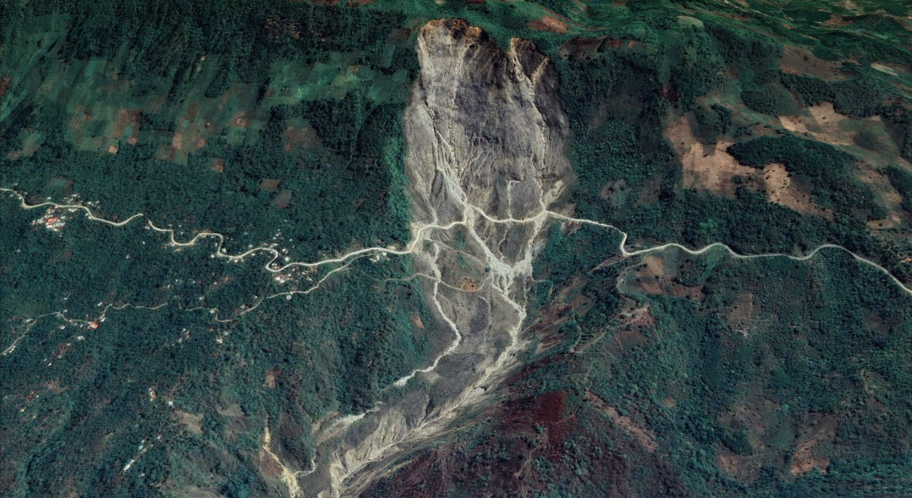

# Landslide detection for rapid Mapping Using Sentinel 2

<a href="#" id='togglescript'>Show</a> script or [download](script_landslides_det.js){:target="_blank"} it.


      


## Description
This repository is a custom scripts explained for detecting landslides using space-based data on **Sentinel Playground** and **EO Browser**. Its goal is to facilitate the landslide inventory and rapid mapping in disaster management.

The custom processing script has been created to support the [recommended practices](https://un-spider.org/advisory-support/recommended-practices) on **Knowledge Portal** of [UN-SPIDER](http://www.un-spider.org/) program of the United Nations Office for Outer Space Affairs - [ONOOSA](https://www.unoosa.org/).

## Evaluation and visualization
* [Sentinel Playground](https://apps.sentinel-hub.com/sentinel-playground/?source=S2L2A&lat=15.38928749640127&lng=-90.63991069793701&zoom=15&preset=CUSTOM&layers=B01,B02,B03&maxcc=100&gain=1.0&gamma=1.0&time=2020-05-01%7C2020-11-11&atmFilter=&showDates=false&evalscript=Ly9WRVJTSU9OPTMuTGFuZHNsaWRlX2RldGVjdGlvbi5VTlNQSURFUgoKLy9ieSBOb3JtYSBkYXZpbGEgJiBBbGV4YW5kZXIgQXJpemEKCmZ1bmN0aW9uIHNldHVwKCkgewogIHJldHVybiB7CiAgICBpbnB1dDogWyJCMDIiLCAiQjAzIiwgIkIwNCIsICJCMDgiLCAiQjExIiwiQ0xNIl0sCiAgICBvdXRwdXQ6IHsgYmFuZHM6IDMgfSwKICAgIAogIH07Cn0KZnVuY3Rpb24gc3RyZXRjaCh2YWwsIG1pbiwgbWF4KSB7cmV0dXJuICh2YWwgLSBtaW4pIC8gKG1heCAtIG1pbik7fQpmdW5jdGlvbiBldmFsdWF0ZVBpeGVsKHNhbXBsZSkgewogIHZhciBic2kgPSAoKHNhbXBsZS5CMTEgKyBzYW1wbGUuQjA0KS0oc2FtcGxlLkIwOCArIHNhbXBsZS5CMDIpKS8oKHNhbXBsZS5CMTEgKyBzYW1wbGUuQjA0KSsoc2FtcGxlLkIwOCArIHNhbXBsZS5CMDIpKTsKICB2YXIgTkRWSSA9IGluZGV4KHNhbXBsZS5CMDgsIHNhbXBsZS5CMDQpOwogIHZhciBORFdJPWluZGV4KHNhbXBsZS5CMDMsc2FtcGxlLkIwOCk7CiAgICAgICAgaWYgKHNhbXBsZS5DTE0gPT0gMSkgewogICAgcmV0dXJuIFtzYW1wbGUuQjA0LAogICAgICAgICAgICBzYW1wbGUuQjAzLAogICAgICAgICAgICAzKnNhbXBsZS5CMDJdCn0KICAKaWYgKE5EV0kgPiAwLjE1KSB7CiByZXR1cm4gWzAsIDAuMiwgMS4wKk5EV0ldCn0KaWYoKHNhbXBsZS5CMTE%2BMC44KXx8KE5EVkk8MC4xNSkpewogIHJldHVyblsxLjUsMC43LC0xXQp9ICAKaWYgKE5EVkk%2BMC4yNSl7CiAgcmV0dXJuIFswICwgMC4yKk5EVkksIDBdCn0KZWxzZSB7CiByZXR1cm4gWzMuNSpic2ksIDAuMywgMF0KfQoKfQo%3D)
* [EO Browser](https://apps.sentinel-hub.com/eo-browser/?zoom=15&lat=15.37373&lng=-90.5406&themeId=DEFAULT-THEME&datasetId=S2L2A&fromTime=2020-11-10T00%3A00%3A00.000Z&toTime=2020-11-10T23%3A59%3A59.999Z&visualizationUrl=https%3A%2F%2Fservices.sentinel-hub.com%2Fogc%2Fwms%2Fbd86bcc0-f318-402b-a145-015f85b9427e&evalscript=Ly9WRVJTSU9OPTMuTGFuZHNsaWRlX2RldGVjdGlvbi5VTlNQSURFUgoKLy9ieSBOb3JtYSBkYXZpbGEgJiBBbGV4YW5kZXIgQXJpemEKCmZ1bmN0aW9uIHNldHVwKCkgewogIHJldHVybiB7CiAgICBpbnB1dDogWyJCMDIiLCAiQjAzIiwgIkIwNCIsICJCMDgiLCAiQjExIiwiQ0xNIl0sCiAgICBvdXRwdXQ6IHsgYmFuZHM6IDMgfSwKICAgIAogIH07Cn0KZnVuY3Rpb24gc3RyZXRjaCh2YWwsIG1pbiwgbWF4KSB7cmV0dXJuICh2YWwgLSBtaW4pIC8gKG1heCAtIG1pbik7fQpmdW5jdGlvbiBldmFsdWF0ZVBpeGVsKHNhbXBsZSkgewogIHZhciBic2kgPSAoKHNhbXBsZS5CMTEgKyBzYW1wbGUuQjA0KS0oc2FtcGxlLkIwOCArIHNhbXBsZS5CMDIpKS8oKHNhbXBsZS5CMTEgKyBzYW1wbGUuQjA0KSsoc2FtcGxlLkIwOCArIHNhbXBsZS5CMDIpKTsKICB2YXIgTkRWSSA9IGluZGV4KHNhbXBsZS5CMDgsIHNhbXBsZS5CMDQpOwogIHZhciBORFdJPWluZGV4KHNhbXBsZS5CMDMsc2FtcGxlLkIwOCk7CiAgICAgICAgaWYgKHNhbXBsZS5DTE0gPT0gMSkgewogICAgcmV0dXJuIFtzYW1wbGUuQjA0LAogICAgICAgICAgICBzYW1wbGUuQjAzLAogICAgICAgICAgICAzKnNhbXBsZS5CMDJdCn0KICAKaWYgKE5EV0kgPiAwLjE1KSB7CiByZXR1cm4gWzAsIDAuMiwgMS4wKk5EV0ldCn0KaWYoKHNhbXBsZS5CMTE%2BMC44KXx8KE5EVkk8MC4xNSkpewogIHJldHVyblsxLjUsMC43LC0xXQp9ICAKaWYgKE5EVkk%2BMC4yNSl7CiAgcmV0dXJuIFswICwgMC4yKk5EVkksIDBdCn0KZWxzZSB7CiByZXR1cm4gWzMuNSpic2ksIDAuMywgMF0KfQoKfQoK)

## Definition of landslides
According to the United Nations Office for Disaster Risk Reduction [(UNDRR)](https://www.unisdr.org/files/52828_03landslidehazardandriskassessment.pdf#page=2), landslides are a "variety of processes that result in the downward and outward movement of slope-forming materials, including rock, soil, artificial fill, or a combination of these. The materials may move by falling, toppling, sliding, spreading, or flowing."

**Landslides trigering by [ETA hurricane](https://emergency.copernicus.eu/mapping/list-of-components/EMSR481) in San Cristóbal de Verapaz – Guatemala. Sentinel 2 acquired on 10/11/2020**
</img>

## General description of the Script 
The script to landslide detection for rapid mapping is based in the response of the Barren Soil Index [BSI](https://custom-scripts.sentinel-hub.com/sentinel-2/barren_soil/) to detect recent traces of soil movements. The results allow to extract the shapes of the landslides in the terrain and to calculate their direction of movement. In the same way, The script use the [NDWI](https://custom-scripts.sentinel-hub.com/sentinel-2/ndwi/), [NDVI](https://custom-scripts.sentinel-hub.com/sentinel-2/ndvi/), and B11 for differntiate between water with sediment, built up areas, barren areas and vegetated areas. The image obtenided show the landslides and barren soil brown color, the water blue tones depending of sediments load, built up areas orange-yellow, and vegetation and other covers in dark green. All pixels related to landslide or barren soil corredonping to values  that B11 lower than 0.8 of reflectivity or NDVI values greater than 0.15, returnint the BSI in the red and green channel (showing in brown to orange); the rest of values are linked with built up and urban areas (showing in orange to yellow); other pixels with NDVI values greater than 0.25 are associated to vegetation (showing NDVI in the green channel). Finally, pixels with NDWI values greater than 0.15 are considered as water, that depending on the sediment load will appear in blue tones.

The first script version confused the high reflectivity of clouds with the bare soil; for this reason, the new script includes a Cloud masks computed using the CLP (cloud probabilities) of [s2cloudless](https://docs.sentinel-hub.com/api/latest/user-guides/cloud-masks/#cloud-masks-and-cloud-probabilities), that are available at Sentinel Hub. The script returns three bands (R/G/B and CLM) will result a real imagen, as well as the fraction of cloudy pixels per each observation.
## Interpretation and description of images
Landslides are a geological hazard which can cause extreme damage to infrastructure and loss of life. Severe hurricane, typhoons and earthquakes frequently generate widespread landslides, which can cause damage to roads and cut off rivers can cause flooding and destabilization of the ground, in turn inducing landslidthe isolation of the affected areasesand preventing the supply of aid.

**Tropical storm "ETA hurricane" in San Cristóbal de Verapaz - Guatemala - Central America, 08/11/2020 ([Euronews](https://www.msn.com/de-de/news/panorama/tropensturm-eta-w-c3-bctet-weiter-in-mittelamerika-kurs-nord/vi-BB1aOp6L))**
</img>

The outcomes are shown according to R:G:B composite image where the yellow color represents bare soils, while orange and brown colors are linked to surficial soils or debris slides, which have suffered a remotion or emplacement motion. Particularly,  for an active landslide, both colors matching with vertical erosion towards the proximal area of the landslide (headwerd) or over talud deposits.

**Landslide detection for rapid mapping KML layer exported from [EO Browser](https://apps.sentinel-hub.com/eo-browser/?zoom=16&lat=15.37631&lng=-90.53612&themeId=DEFAULT-THEME&datasetId=S2L2A&fromTime=2020-11-10T00%3A00%3A00.000Z&toTime=2020-11-10T23%3A59%3A59.999Z&visualizationUrl=https%3A%2F%2Fservices.sentinel-hub.com%2Fogc%2Fwms%2Fbd86bcc0-f318-402b-a145-015f85b9427e&evalscript=Ly9WRVJTSU9OPTMuTGFuZHNsaWRlX2RldGVjdGlvbi5VTlNQSURFUgoKLy9ieSBOb3JtYSBkYXZpbGEgJiBBbGV4YW5kZXIgQXJpemEKCmZ1bmN0aW9uIHNldHVwKCkgewogIHJldHVybiB7CiAgICBpbnB1dDogWyJCMDIiLCAiQjAzIiwgIkIwNCIsICJCMDgiLCAiQjExIiwiQ0xNIl0sCiAgICBvdXRwdXQ6IHsgYmFuZHM6IDMgfSwKICAgIAogIH07Cn0KZnVuY3Rpb24gc3RyZXRjaCh2YWwsIG1pbiwgbWF4KSB7cmV0dXJuICh2YWwgLSBtaW4pIC8gKG1heCAtIG1pbik7fQpmdW5jdGlvbiBldmFsdWF0ZVBpeGVsKHNhbXBsZSkgewogIHZhciBic2kgPSAoKHNhbXBsZS5CMTEgKyBzYW1wbGUuQjA0KS0oc2FtcGxlLkIwOCArIHNhbXBsZS5CMDIpKS8oKHNhbXBsZS5CMTEgKyBzYW1wbGUuQjA0KSsoc2FtcGxlLkIwOCArIHNhbXBsZS5CMDIpKTsKICB2YXIgTkRWSSA9IGluZGV4KHNhbXBsZS5CMDgsIHNhbXBsZS5CMDQpOwogIHZhciBORFdJPWluZGV4KHNhbXBsZS5CMDMsc2FtcGxlLkIwOCk7CiAgICAgICAgaWYgKHNhbXBsZS5DTE0gPT0gMSkgewogICAgcmV0dXJuIFtzYW1wbGUuQjA0LAogICAgICAgICAgICBzYW1wbGUuQjAzLAogICAgICAgICAgICAzKnNhbXBsZS5CMDJdCn0KICAKaWYgKE5EV0kgPiAwLjE1KSB7CiByZXR1cm4gWzAsIDAuMiwgMS4wKk5EV0ldCn0KaWYoKHNhbXBsZS5CMTE%2BMC44KXx8KE5EVkk8MC4xNSkpewogIHJldHVyblsxLjUsMC43LC0xXQp9ICAKaWYgKE5EVkk%2BMC4yNSl7CiAgcmV0dXJuIFswICwgMC4yKk5EVkksIDBdCn0KZWxzZSB7CiByZXR1cm4gWzMuNSpic2ksIDAuMywgMF0KfQoKfQoK#custom-script) over 3D model in Google Earth**
</img>

The preliminary results showed that the use of BSI, NDVI and NDWI in combination with the B11 reflectance are sufficient to identify recent traces of soil movements useful for rapid mapping response during a disaster event. In this case, the use of the BSI index itself has not able to characterize the landslide configurations on terrain, due to after landslide event, the spectral response change shortly especially over zones with fast reactivation in the vegetation cover. Therefore, in order to improve the interpretation of the results, we recommended a temporal analysis (pre and post events) to get better outcomes of BSI values linked to landslide targets. 

**Sentinel 2 image acquired by 01/09/2020 before landslide events in Queja - Alta Verapaz comparing spectral indexes on bare soils**
</img>

**Sentinel 2 image acquired by 10/11/2020 after landslide events in Queja - Alta Verapaz comparing spectral indexes on bare soils**
</img>
Limitations exist when the script trie to separating barren soil from buildings, due to a similar spectral response. It is thus most valuable in rural regions with steep slopes, allowing to locate landslides by their shape, that facilitating rapid inventory of landslides in the event of disasters. Future use of a DEM would allow for better discrimination.

## Author of the script
- Alexander Ariza
- Norma Davila
      
## Credits & references
For the Landslide detection script the Barren soil index [BSI](https://custom-scripts.sentinel-hub.com/sentinel-2/barren_soil/) and the a version modified of Urban Classification proposed by Monja Šebela was used.

[1] Ariza Ortiz, A., Roa Melgarejo, O. J., Serrato, P. K., & León Rincón, H. A. (2018). Using spectral ratios derived from remote sensing to geomorphological surveys in island areas of the Colombian Caribbean. Perspectiva Geográfica. https://doi.org/10.19053/01233769.5863

[2] Dávila-Hernández, N., Lira, J., Capra-Pedol, L., & Zucca, F. (2011). A normalized difference lahar index based on Terra/Aster and Spot 5 images: An application at Colima Volcano, Mexico. Revista Mexicana de Ciencias Geologicas.
